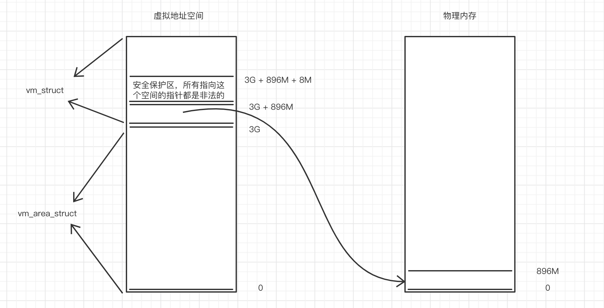

## 1. 前置知识

### 1.1 Linux 设备类型

Linux 内核中的设备可分为三类：字符设备、块设备和网络设备。

**字符设备**：适合面向字符的数据交换，因其数据传输量较低。对这种设备的读写是按字符进行的，而且这些字符是连续地形成一个数据流。它不具备缓冲去，所以对这种设备的读写是实时的，如终端、磁带机、串口、键盘等。

### 1.2 Linux 内核文件系统

Linux 下有专门的文件系统用来对设备进行管理，devfs 和 sysfs 就是其中两种。

devfs、sysfs 都是和 proc 一样，是一个虚拟的文件系统。向 devfs 注册的驱动程序，devfs 将会在 `/dev` 下建立相应的设备文件。

**proc 虚拟文件系统: ** 在 Linux 系统中被挂载于 `/proc` 目录下。里面的文件包含了很多系统信息，比如 cpu 负载、内存、网络配置和文件系统等等。

**devfs 设备文件系统: ** 提供类似于文件的方法来管理位于 `/dev` 目录下的设备。

1. `/dev`：设备文件创建、创建根文件系统时创建基本的（如 console、tty* 等）、设备驱动加载时创建相应的设备文件。
2. 特殊设备文件：`/dev/console`、`/dev/null`、`/dev/zero（黑洞文件）`
3. 缺点：不确定的设备映射，有时一个设备映射的设备文件可能不同，假如挂载的 u盘可能对应 sda 也可能对应 sdb。没有足够的主/辅设备号，当设备过多的时候，显然会成为一个问题。

### 1.3 dev_get_drvdata() 函数

```c
/* driver/base/dd.c */
void *dev_get_drvdata(const struct device *dev)
{
  if(dev && dev->p)
    return dev->p->driver_data;
  return NULL;
}
```

### 1.4 msic 类型的字符设备


### 1.5 虚拟地址空间

Linux 内核中，一个进程可以占用的虚拟地址空间是 4G。其中 0~3G 是用户地址空间（`vm_area_struct` 描述），3G~4G 是内核地址空间（`vm_struct` 描述）。

实际上，vm_struct 所描述的内核地址空间范围只有 (3G+896M+8M) ~ 4G。



