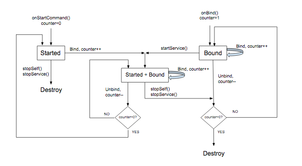

# Building a media browser service（构建媒体浏览器服务）

> 译：https://developer.android.com/guide/topics/media-apps/audio-app/building-a-mediabrowserservice

你的应用必须在其 manifest 中声明 `MediaBrowserService` 并使用 intent-filter。你可以选择自己的 service name。在下面的实例中，它是 “MediaPlaybackService” 。

``` java
<service android:name=".MediaPlaybackService">
  <intent-filter>
    <action android:name="android.media.browse.MediaBrowserService" />
  </intent-filter>
</service>
```

> **Note:** `MediaBrowserService` 的推荐实现是 `MediaBrowserServiceCompat`。这是在 media-compat 支持库中定义的。在整个页面中，术语 “MediaBrowserService” 指的是 `MediaBrowserServiceCompat` 的实例。


## Initialize the media session

当服务收到 `onCreate（）`生命周期回调方法时，它应该执行以下步骤：
- 创建和 [初始化 media session](https://developer.android.com/guide/topics/media-apps/working-with-a-media-session#init-session)
- 设置 `media session` 的 callback
- 设置 `media session token`

下面的 `onCreate()` 代码演示了以下步骤：

``` java
public class MediaPlaybackService extends MediaBrowserServiceCompat {
    private static final String MY_MEDIA_ROOT_ID = "media_root_id";
    private static final String MY_EMPTY_MEDIA_ROOT_ID = "empty_root_id";

    private MediaSessionCompat mMediaSession;
    private PlaybackStateCompat.Builder mStateBuilder;

    @Override
    public void onCreate() {
        super.onCreate();

        // Create a MediaSessionCompat
        mMediaSession = new MediaSessionCompat(context, LOG_TAG);

        // Enable callbacks from MediaButtons and TransportControls
        mMediaSession.setFlags(
              MediaSessionCompat.FLAG_HANDLES_MEDIA_BUTTONS |
              MediaSessionCompat.FLAG_HANDLES_TRANSPORT_CONTROLS);

        // Set an initial PlaybackState with ACTION_PLAY, so media buttons can start the player
        mStateBuilder = new PlaybackStateCompat.Builder()
                            .setActions(
                                PlaybackStateCompat.ACTION_PLAY |
                                PlaybackStateCompat.ACTION_PLAY_PAUSE);
        mMediaSession.setPlaybackState(mStateBuilder.build());

        // MySessionCallback() has methods that handle callbacks from a media controller
        mMediaSession.setCallback(new MySessionCallback());

        // Set the session's token so that client activities can communicate with it.
        setSessionToken(mMediaSession.getSessionToken());
    }
}
```

## Manage client connections

`MediaBrowserService` 有两种处理客户端连接的方法： `onGetRoot()` 控制对服务的访问， `onLoadChildren()` provides the ability for a client to build and display a menu of the `MediaBrowserService`'s content hierarchy.

#### Controlling client connections with onGetRoot()

`onGetRoot()` 方法返回内容层次结构的根节点。如果方法返回 null，则拒绝连接。

要允许客户端连接到你的服务并浏览其媒体内容，`onGetRoot()` 必须返回一个非空的 BrowserRoot，它是表示你的内容层次结构的 root ID 。

要允许客户端在不浏览媒体内容的情况下连接到 `MediaSession`，`onGetRoot()` 仍必须返回非空的 BrowserRoot，但 root ID 应该表示空的内容层次结构。

`onGetRoot()` 的典型实现可能如下所示：

``` java
@Override
public BrowserRoot onGetRoot(String clientPackageName, int clientUid,
    Bundle rootHints) {

    // (Optional) Control the level of access for the specified package name.
    // You'll need to write your own logic to do this.
    if (allowBrowsing(clientPackageName, clientUid)) {
        // Returns a root ID that clients can use with onLoadChildren() to retrieve
        // the content hierarchy.
        return new BrowserRoot(MY_MEDIA_ROOT_ID, null);
    } else {
        // Clients can connect, but this BrowserRoot is an empty hierachy
        // so onLoadChildren returns nothing. This disables the ability to browse for content.
        return new BrowserRoot(MY_EMPTY_MEDIA_ROOT_ID, null);
    }
}
```

在某些情况下，您可能希望实施白/黑名单方案来控制连接。有关白名单的示例，请参阅 [Universal Android Music Player](https://github.com/googlesamples/android-UniversalMusicPlayer) 中的 [PackageValidator](https://github.com/googlesamples/android-UniversalMusicPlayer/blob/v1/mobile/src/main/java/com/example/android/uamp/PackageValidator.java) 类。

> **Note:** 你应该考虑提供不同的内容层次结构，具体取决于进行查询的客户端类型。特别是，Android Auto 限制了用户与音频应用的互动方式。有关更多信息，请参阅 [Playing Audio for Auto](https://developer.android.com/training/auto/audio/#build_hierarchy) 。你可以在连接时查看 `clientPackageName` 以确定客户端类型，并根据客户端（或 `rootHints`，如果有的话）返回不同的 `BrowserRoot`。

#### Communicating content with onLoadChildren()

在客户端连接之后，它可以通过重复调用 `MediaBrowserCompat.subscribe()` 来遍历内容层次结构，以构建 UI 的本地表示。`subscribe()` 方法将回调 service 的 `onLoadChildren()` ，该方法的参数中会返回 [MediaBrowser.MediaItem](https://developer.android.com/reference/android/media/browse/MediaBrowser.MediaItem)对象的 List。

每个 MediaItem 都有一个唯一的 ID，它是一个不透明的 token。当客户端想要打开子菜单或播放一个项目时，它会传递 ID。你的服务负责将 ID 与相应的菜单节点或内容项相关联。

一个简单的 `onLoadChildren()` 的实现：

``` java
@Override
public void onLoadChildren(final String parentMediaId,
    final Result<List<MediaItem>> result) {

    //  Browsing not allowed
    if (TextUtils.equals(MY_EMPTY_MEDIA_ROOT_ID, parentMediaId)) {
        result.sendResult(null);
        return;
    }

    // Assume for example that the music catalog is already loaded/cached.

    List<MediaItem> mediaItems = new ArrayList<>();

    // Check if this is the root menu:
    if (MY_MEDIA_ROOT_ID.equals(parentMediaId)) {
        // Build the MediaItem objects for the top level,
        // and put them in the mediaItems list...
    } else {
        // Examine the passed parentMediaId to see which submenu we're at,
        // and put the children of that menu in the mediaItems list...
    }
    result.sendResult(mediaItems);
}
```
> **Note:** `MediaBrowserService` 提供的 **MediaItem** 对象不应包含 icon bitmaps。在为每个 item 构建 [MediaDescription](https://developer.android.com/reference/android/media/MediaDescription) 时，通过调用 [setIconUri](https://developer.android.com/reference/android/media/MediaDescription.Builder#setIconUri(android.net.Uri)) 来使用 Uri。

有关如何实现 `onLoadChildren()` 的示例，请参阅 [MediaBrowserService](https://github.com/googlesamples/android-MediaBrowserService) 和 [Universal Android Music Player](https://github.com/googlesamples/android-UniversalMusicPlayer) 。

## The media browser service lifecycle

Android [Service](https://developer.android.com/guide/components/services) 的行为取决于它是 启动 还是 绑定 到一个或多个客户端。创建服务后，可以启动，绑定或同时（就是既启动又绑定）。在所有这些状态中，服务都是功能齐全的，并且可以有效执行它被安排的工作。不同之处在于服务存活时间。一个绑定的服务在其**所有**绑定的客户端解绑之前不会被销毁。一个启动的服务可以明确的停止和销毁（假定没有任何客户端绑定了该服务）。

当一个连接到 `MediaBrowserService` 的 `MediaBrowser` 运行在另一个 Activity 时，它会将这个 Activity 绑定到 Service 上，从而使 Service bound（but not started）。此默认行为内置于 `MediaBrowserServiceCompat` 类中。

只有绑定状态（并且未启动）的服务在其所有客户端解绑时才会销毁「原文：A service that is only bound (and not started) is destroyed when all of its clients unbind. 」。 如果此时 UI Activity 断开链接，则服务将被销毁。如果你还没有播放任何音频，这就不是问题。但是，当已经开始播放时，用户可能希望在切换应用后继续收听。所以，当你取消绑定 UI，去使用其他 app 时，你不希望销毁正在播放的播放器。

因此，当开始播放音频时，你需要确保调用 [startService()](https://developer.android.com/reference/android/content/Context#startService(android.content.Intent)) 来启动 Service。无论是否绑定，一个启动了的服务必须明确调用 `stopService` 或 `stopSelf` 来销毁自己。这就保证了你的播放器可以继续执行，即使当前 UI Activity 解除了绑定。

要停止已启动的服务，请调用 [Context.stopService()](https://developer.android.com/reference/android/content/Context#stopService(android.content.Intent)) 或 [stopSelf()](https://developer.android.com/reference/android/app/Service.html#stopSelf())。系统会尽快停止并销毁服务。但是，如果一个或多个客户端仍然绑定到该服务，则停止该服务的调用将延迟，直到其所有客户端解除绑定。

`MediaBrowserService` 的生命周期由其创建方式、绑定到它的客户端数量以及从 `media session callbacks` 接收的调用 来进行控制。总结如下：

- 当通过响应 media button 启动，或 activity 绑定到该服务时（通过 MediaBrowser 连接后），服务被创建。「原文：The service is created when it is started in response to a media button or when an activity binds to it (after connecting via its MediaBrowser).」

- media session `onPlay()` 的回调应该包含调用调用 [startService](https://developer.android.com/reference/android/content/Context#startService(android.content.Intent)) 的代码。这可确保服务启动并继续运行，即使绑定到它的所有 UI `MediaBrowser` activities 都解除了绑定。

- `onStop()` 回调应该调用 `stopSelf()`。如果服务已经启动，则会 stop 该服务。此外，如果没有绑定的活动，服务将被销毁。否则，服务将保持绑定，直到其所有 activity 解除绑定。（如果在销毁服务之前收到后续的 `startService()` 调用，则取消之前挂起的 stop ）

以下流程图演示了如何管理服务的生命周期。变量计数器跟踪绑定客户端的数量：



## Using MediaStyle notifications with a foreground service

当服务正在播放时，它应该在前台运行。这使系统知道服务正在执行有用的功能，如果系统内存不足，不应该杀掉该服务。前台服务必须显示通知，以便用户知道它并可以选择控制它。`onPlay()` 的回调应该将服务放在前台。（请注意：这是 "foreground" 的特殊含义。虽然 Android 考虑前台服务的目的是 进程管理，但对用户而言，播放器仍处在后台播放，而其他app 在屏幕的 “foregournd” 中是可见的。 「原文：Note that this is a special meaning of "foreground." While Android considers the service in the foreground for purposes of process management, to the user the player is playing in the background while some other app is visible in the "foreground" on the screen」）

当服务在前台运行时，它必须显示通知，理想情况下是一个或多个传输控制。通知还应包括会话元数据中的有用信息。

当播放器开始播放时构建并显示通知。执行此操作的最佳位置是 `MediaSessionCompat.Callback.onPlay()` 方法。

下面的示例使用 [NotificationCompat.MediaStyle](https://developer.android.com/reference/android/support/v4-media-app/NotificationCompat.MediaStyle) ，它是专为媒体应用程序设计的。它展示了如何构建显示 metadata 和 transport controls 的通知。[getController](https://developer.android.com/reference/android/support/v4/media/session/MediaSessionCompat#getController()) 运行你直接从 `media session` 创建 `media controller` 。

```java
// Given a media session and its context (usually the component containing the session)
// Create a NotificationCompat.Builder

// Get the session's metadata
MediaControllerCompat controller = mediaSession.getController();
MediaMetadataCompat mediaMetadata = controller.getMetadata();
MediaDescriptionCompat description = mediaMetadata.getDescription();

NotificationCompat.Builder builder = new NotificationCompat.Builder(context, channelId);

builder
    // Add the metadata for the currently playing track
    .setContentTitle(description.getTitle())
    .setContentText(description.getSubtitle())
    .setSubText(description.getDescription())
    .setLargeIcon(description.getIconBitmap())

    // Enable launching the player by clicking the notification
    .setContentIntent(controller.getSessionActivity())

    // Stop the service when the notification is swiped away
    .setDeleteIntent(MediaButtonReceiver.buildMediaButtonPendingIntent(context,
       PlaybackStateCompat.ACTION_STOP))

    // Make the transport controls visible on the lockscreen
    .setVisibility(NotificationCompat.VISIBILITY_PUBLIC)

    // Add an app icon and set its accent color
    // Be careful about the color
    .setSmallIcon(R.drawable.notification_icon)
    .setColor(ContextCompat.getColor(context, R.color.primaryDark))

    // Add a pause button
    .addAction(new NotificationCompat.Action(
        R.drawable.pause, getString(R.string.pause),
        MediaButtonReceiver.buildMediaButtonPendingIntent(context,
            PlaybackStateCompat.ACTION_PLAY_PAUSE)))

    // Take advantage of MediaStyle features
    .setStyle(new MediaStyle()
        .setMediaSession(mediaSession.getSessionToken())
        .setShowActionsInCompactView(0)

        // Add a cancel button
       .setShowCancelButton(true)
       .setCancelButtonIntent(MediaButtonReceiver.buildMediaButtonPendingIntent(context,
           PlaybackStateCompat.ACTION_STOP)));

// Display the notification and place the service in the foreground
startForeground(id, builder.build());
```

使用 MediaStyle 通知时，请注意这些 NotificationCompat 设置的行为：
- 当你使用 [setContentIntent](https://developer.android.com/reference/android/app/Notification.Builder#setContentIntent(android.app.PendingIntent)) 时，你的服务会在单击通知时自动启动，这是一个方便的功能。

- 在像锁屏这样 “不受信任(untrusted)” 的情况下，通知内容的默认可见性是 [VISIBILITY_PRIVATE](https://developer.android.com/reference/android/app/Notification#VISIBILITY_PRIVATE)。你可能希望在锁屏上看到 transport controls，因此 [VISIBILITY_PUBLIC](https://developer.android.com/reference/android/app/Notification#VISIBILITY_PUBLIC) 是最佳选择。

- 设置背景颜色时要小心。在 Android5.0 或更高版本的普通通知中。颜色仅用于 small app icon 的背景。但对于 Android7.0 之前的 MediaStyle 通知，颜色会用于整个通知背景。测试你的背景颜色，避免使用极其明亮的颜色。

只有在使用 `NotificationCompat.MediaStyle` 时，这些设置才可用：
- 使用 [setMediaSession()](http://) 将通知与你的 session 相关联。这允许第三方应用和配套设备访问和控制 session。

- 使用 [setShowActionsInCompactView()](http://) 在通知的标准大小的 contentView 中可以通过使用 添加最多3个操作。（上面的示例代码指定了暂停按钮。）

- 在 Android5.0（API 级别为21）及更高版本中，一旦服务不再在前台运行，你可以滑动通知以停止播放器。你不能在早期的安卓版本中执行此操作。要允许用户在 Android5.0 之前删除通知并停止播放，你可以通过调用 [setShowCancelButton](http://) 和 [setCancelButtonIntent](http://) 在通知的右上角添加取消按钮。

添加暂停和取消按钮时，you'll need a PendingIntent to attach to the playback action.
[MediaButtonReceiver.buildMediaButtonPendingIntent()](http://) 方法完成将 PlaybackState 操作转换为 PendingIntent 的工作。


