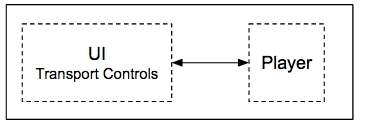
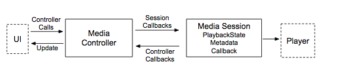
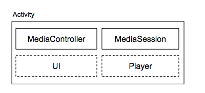
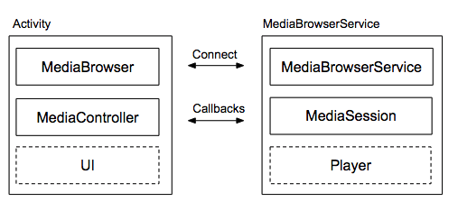
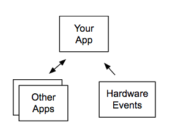

# Media app architecture overview

> 译：https://developer.android.com/guide/topics/media-apps/media-apps-overview

本节介绍如何将 媒体播放应用 分割为 `media controller`（用于 UI）和 `media session`（用于实际播放）。
它描述了两种媒体应用程序架构：适用于音频应用程序的 client/server 设计，以及 适用于视频播放的单 Activity 设计。还说明了如何使媒体应用程序响应硬件控制并与使用音频输出流的其他应用程序协作。

## Player and UI

播放音频或视频的多媒体应用程序通常包含两部分：
- 将数字媒体呈现为视频或音频的 player
- 具有传输控制的 UI，用于运行 player 并显示播放状态。

在 Android 中，你可以从头开始构建自己的播放器，或者从以下选项中进行选择：
- [MediaPlayer](https://developer.android.com/guide/topics/media/mediaplayer) 为 **支持最常见音频/视频格式和数据源的简单播放器** 提供基本功能。
- [ExoPlayer](https://developer.android.com/guide/topics/media/exoplayer) 是一个开源库，可以公开较低级别的 Android 音频 API。 ExoPlayer 支持 MediaPlayer 中没有的高性能功能，如 DASH 和 HLS流。你可以自定义 ExoPlayer 代码，从而轻松添加新组件。 ExoPlayer 只能用于 Android 4.1 及更高版本。

## Media sessoin and media controller

虽然 UI 和播放器的 API 可以是任意的，但两个部分之间的交互性质对于所有媒体播放器应用程序来讲基本相同。 Android 框架定义了两个类，一个 `media session` 和一个 `media controller`，它们构建了一个定义良好的结构来构建媒体播放器应用程序。

`media session` 和 `media controller` 之间的通信是通过预先定义的回调来进行的，这个回调对应于 player 的一些操作（play、pause、stop等）。当然你也可以为你自己的 app 的一些特殊行为通过自定义回调来进行相互通信。

#### Media session

`media session` 负责所有与 player 的通信。It hides the player's API from the rest of your app. The player is only called from the media session that controls it.

session 保持 player's state (playing/paused) 的表示以及有关正在播放的内容的信息。
session 可以从一个或多个 `media controller` 接收回调。这使你的 player 可以通过 UI 以及运行 Wear OS 和 Android Auto 的配套设备 进行控制。

#### Media controller

`media controller` 隔离了您的UI。您的UI代码仅与 `media controller` 通信，而不是与 player 本身通信。`media controller` 将传输控制动作转换为对 `media session` 的回调。每当会话状态改变时，它还从 `media session` 接收回调。这提供了一种自动更新关联 UI 的机制。`media controller` 一次只能连接一个 `media session`。

使用 `media controller` 和 `media session` 时，可以在运行时部署不同的接口或 player。您可以根据运行设备的功能，单独更改应用程序的外观或性能。

## Video apps 与 Audio apps

在播放视频时，您的眼睛和耳朵都会被吸引。播放音频时，您正在聆听，但您也可以同时使用其他应用。每个用例都有不同的设计。

#### Video app

视频应用需要一个用于查看内容的窗口。因此，a video app is usually implemented as a single Android activity. 视频出现的屏幕是 Activity 的一部分。

#### Audio app

音频播放并不总是需要显示其 UI。一旦它开始播放音频，播放器就可以作为后台任务运行。用户可以切换到其他 app 并继续收听。

要在 Android 中实现此设计，您可以使用两个组件构建音频 app：**activity** for the UI 和 **service** for the player .
如果用户切换到另一个应用程序，service 可以在后台运行。通过将音频应用程序的两个部分分解为单独的组件，每个组件都可以自己更高效地运行。与播放器相比，UI 通常是短暂的，播放器可能在没有 UI 的情况下运行很长时间。

`support library` 提供了两个类来实现 client/server 方法：MediaBrowserService 和 MediaBrowser。service 组件实现为 MediaBrowserService 的子类，包含 `media session` 和 player。带有 UI 和 `media controller` 的 Activity 应该包括 MediaBrowser，它与 MediaBrowserService 进行通信。

使用 MediaBrowserService 可以让配套设备（如 Android Auto 和 Wear）轻松发现您的应用，连接到它，浏览内容和控制播放，而无需访问您的 UI 活动。

## Media apps and the Android audio 基础结构

精心设计的媒体应用程序应与其他播放音频的应用程序 “很好地协同工作”。它应该准备好共享手机并与您设备上使用音频的其他应用程序合作。它还应响应设备上的硬件控制。

[Controlling Audio Output](https://developer.android.com/guide/topics/media-apps/volume-and-earphones) 这一节中描述了所有这些行为。

## The media-compat library（媒体兼容库）

[media-compat](https://developer.android.com/reference/android/support/v4/media/session/package-summary) 库包含有助于构建播放音频和视频的应用程序的类。这些类与运行 Android 2.3（API级别9）及更高版本的设备兼容。它们还可以与其他 Android 功能配合使用，以创建舒适，熟悉的 Android 体验。

`media session` 和 `media controller` 的推荐实现是 [MediaSessionCompat](https://developer.android.com/reference/android/support/v4/media/session/MediaSessionCompat) 和 [MediaControllerCompat](https://developer.android.com/reference/android/support/v4/media/session/MediaControllerCompat)，它们在 [media-compat support library](https://developer.android.com/topic/libraries/support-library/features#media-playback) 中定义。
它们取代了 Android 5.0（API级别21）中引入的早期版本的 `MediaSession` `和MediaController`。 `compat 类提供相同的功能`，但更容易开发您的应用程序，因为您只需要写入一个 API。该库通过将 `media session` 的方法转换为旧平台版本上的等效方法（如果可用）来处理向后兼容性。

如果您已经有一个使用旧类的工作应用程序，我们建议您更新到 `compat类`。当您使用 `compat` 版本时，您可以删除对 [registerMediaButtonReceiver ( )](https://developer.android.com/reference/android/media/AudioManager#registerMediaButtonEventReceiver(android.content.ComponentName) 的所有调用以及 [RemoteControlClient](https://developer.android.com/reference/android/media/RemoteControlClient) 中的所有方法。

## Measuring performance（测量性能）

在 Android 8.0（API 级别26）及更高版本中，getMetrics（）方法适用于某些 media classes 。它返回包含配置和性能信息的 [PersistableBundle](https://developer.android.com/reference/android/os/PersistableBundle) 对象，表示为属性和值的一个 map 。这些媒体类定义了getMetrics（）方法：

- [MediaPlayer.getMetrics](https://developer.android.com/reference/android/media/MediaPlayer#getMetrics()
- [MediaRecorder.getMetrics](https://developer.android.com/reference/android/media/MediaRecorder#getMetrics(\))
- [MediaCodec.getMetrics](https://developer.android.com/reference/android/media/MediaPlayer#getMetrics()
- [MediaExtractor.getMetrics](https://developer.android.com/reference/android/media/MediaPlayer#getMetrics()

为每个实例单独收集度量标准，并持续实例的生命周期。如果没有可用的度量标准，则该方法返回 null 。返回的实际指标取决于类。
