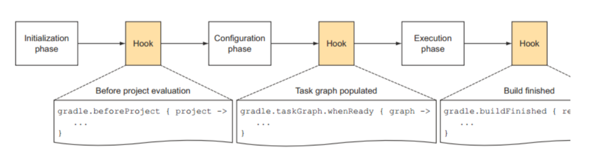

## Gradle 介绍

> Build scripts are code

### 1. 基本组件

Gradle 是一个框架，它定义一套自己的游戏规则。

Gradle 中每一个待编译的工程都是一个 Project，一个具体的编译过程是由一个一个的 Task 来定义和执行的。

每一个 Library 和每一个 App 都是单独的 Project。根据 Gradle 的要求，每一个 Project 在其根目录下都需要有一个 build.gradle。build.gradle 文件就是该 Project 的编译脚本，类似于 Makefile。

#### 1.1 gradle 命令介绍

1. `gradle projects` 查看工程信息。
2. `gradle tasks` 查看任务信息。想看某个具体 Project 包含哪些 Task 信息，可以执行 `gradle project-path:tasks` ，注意，`project-path` 是目录名，后面必须跟冒号。不过你要是已经 cd 到某个 Project 的目录了，则不需要指定 project-path。
3. `gradle task-name` 执行任务。

### 2. Gradle 工作流程



主要三个阶段：

- 首先是初始化阶段。对 multi-project build 而言，就是执行 settings.gradle。**执行完后可 Hook**
- Configuration 阶段。解析每个 project 中的 build.gradle。该阶段完了后，整个 build 的 project 以及内部的 task 关系就确定了。Configuration 会建立一个有向图来描述 task 之间的依赖关系。**当 task 关系图建立好后，可以 Hook**
- 最后是执行任务阶段。**任务执行完后，可 Hook**


### 3. Gradle 编程模型及 API 实例详解

Gradle 执行的时候和 Groovy 一样，会把脚本转换成 Java 对象。Gradle 主要有三种对象，这三种对象和三种不同的脚本文件对应：

- Gradle 对象：当我们执行 gradle xxx 的时候，gradle 会从默认的配置脚本中构造出一个 Gradle 对象。在整个执行过程中，只有这么一个对象。Gradle 对象的数据类型就是 Gradle。我们一般很少去定制这个默认的配置脚本。
- Project 对象：每一个 build.gradle 会转换成一个 Project 对象。
- Settings 对象：每一个 settings.gradle 会转换成一个 Settings 对象。

#### 3.1 Gradle 对象

https://docs.gradle.org/current/dsl/org.gradle.api.invocation.Gradle.html

该文档列举了 Gradle 所拥有的一些属性。在 build.gradle 和 settings.gradle 中可通过如下方式获得 Gradle 实例，并调用它的一些函数

```groovy
println "In android-UniversalMusicPlayer, gradle id is " + gradle.hashCode()
println "Home Dir: " + gradle.gradleHomeDir
println "User Home Dir: " + gradle.gradleUserHomeDir
println "Parent : " + gradle.parent
println "rootProject : " + gradle.rootProject
println "plugins : " + gradle.getPlugins()
println "startParameter : " + gradle.startParameter
```


#### 3.2 Project 对象

每一个 build.gradle 文件都会转换成一个 Project 对象。在 Gradle 术语中，Project 对象对应的是 Build Script。
Project 包含若干 Tasks。另外，由于 Project 对应具体的工程，所以需要为 Project 加载所需要的插件，比如为 Java 工程加载 Java 插件。其实，一个 Project 包含多少 Task 往往是插件决定的。 

所以在 Project 中，我们要：

- 加载插件。
- 不同插件有不同的行话，即不同的配置。我们要在 Project 中配置好，这样插件就知道从哪里读取源文件了等。
- 设置属性。

#####  1. Project 通过 [apply](https://docs.gradle.org/current/javadoc/org/gradle/api/plugins/PluginAware.html#apply-groovy.lang.Closure-) 函数加载插件。

#####  2. 设置属性：属性需要跨脚本传播。
Gradle 提供一种 `extra property`的方法。在第一次定义该属性的时候通过 ext 前缀标识它是一个额外的属性。定义好后，后面的存取就不需要 ext 前缀了。ext 属性支持 Project 和 Gradle 对象。即 Project 和 Gradle 对象都可以设置 ext 属性。

##### 3. Task 介绍

Task 是 Gradle 中的一种数据类型，它代表了一些要执行或者要做的工作。每一个 Task 都需要和一个 Project 关联。