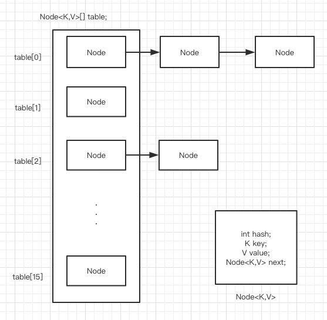
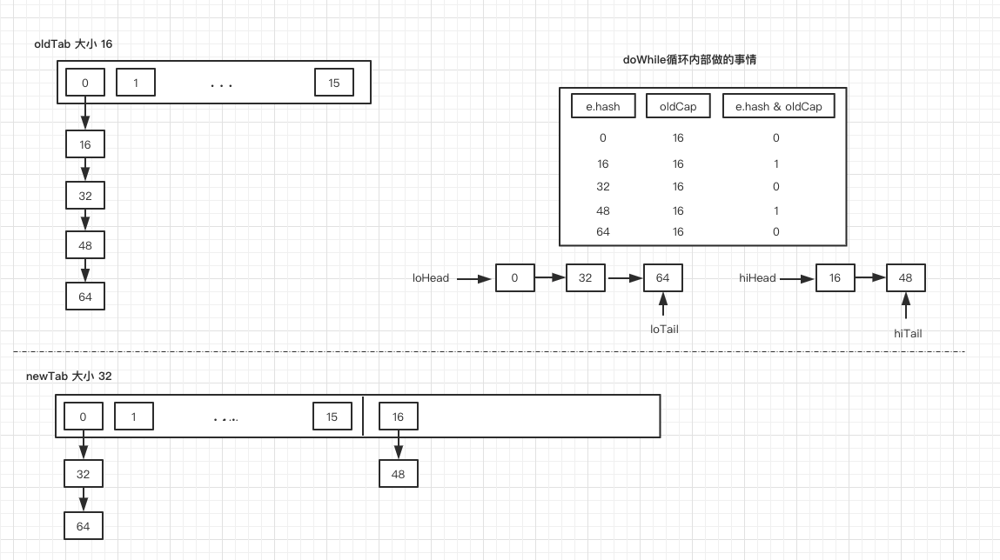

## Map 系列 —— HashMap（JDK1.8）

### 1. Map 接口概述

> 本文源码基于 JDK1.8

**Map 接口定义：**将 key 映射到 value 的一个对象。Map 不能包含重复的 key，每个 key 最多映射一个 value。

Map 接口提供了三个集合视图，来表达 Map 的内容
- key 值的 set 集合
- value 值的 collection 集合
- key-value 映射的 set 集合，这个其实就是 `Set<Map.Entry<K, V>>`

至于 map 的顺序问题是由 map 集合视图上的迭代器返回其元素的顺序决定的。但是有一些 map 的实现可以保证排序问题，例如 **TreeMap**。

注意如果将**可变对象**作为 map 的 key 则必须非常小心。

所有通用 map 实现类都应该提供两个“标准”构造函数：
- 一个无参数的构造函数，创建一个 empty map
- 一个类型为 Map 参数的构造函数，创建一个具有相同键值的新 map

### 2. HashMap 概述
基于哈希表的 Map 接口实现。此实现提供所有可选的 map 操作，并允许 `null values` 和 `null key`。 （HashMap 大致相当于 Hashtable，除了 HashMap 是不同步的并且允许空值）。HashMap 不保证有序，也不保证顺序不随时间变化。

假设散列函数在 buckets 之间正确的分散元素，那么 HashMap 为基本操作（get 和 put）提供了**恒定时间性能**。

HashMap 有两个影响其性能的参数：初始容量（initial capacity）和负载因子（load factor）。容量就是哈希表中 buckets 的数量，负载因子就是 buckets 填满程度的最大比例。当 buckets 填充的数目大于 `capacity * load factor` 时，就需要调整 buckets 的数目为当前的 2 倍。
如果对迭代性能要求很高的话不要把 `initial capacity` 设置过大，也不要把 `load factor` 设置太小。HashMap 开头的注释是这样描述的
> Thus, it's very important not to set the initial capacity too high (or the load factor too low) if iteration performance is important.

### 3. 几个常量

```java
// 默认的 initial capacity —— 必须是 2 的幂
static final int DEFAULT_INITIAL_CAPACITY = 1 << 4; // aka 16

// 最大的 capacity
static final int MAXIMUM_CAPACITY = 1 << 30;

// 默认的加载因子
static final float DEFAULT_LOAD_FACTOR = 0.75f;

// 使用 tree 而不是 list 的阈值
static final int TREEIFY_THRESHOLD = 8;

/**
* The bin count threshold for untreeifying a (split) bin during a
* resize operation. Should be less than TREEIFY_THRESHOLD, and at
* most 6 to mesh with shrinkage detection under removal.
*/
static final int UNTREEIFY_THRESHOLD = 6;

/**
* The smallest table capacity for which bins may be treeified.
* (Otherwise the table is resized if too many nodes in a bin.)
* Should be at least 4 * TREEIFY_THRESHOLD to avoid conflicts
* between resizing and treeification thresholds.
*/
static final int MIN_TREEIFY_CAPACITY = 64;
```

### 4. Node 节点

```java
	// 基本的 hash bin node，用于大多数 entries
	static class Node<K,V> implements Map.Entry<K,V> {
        final int hash;
        final K key;
        V value;
        Node<K,V> next;
```



### 5. 相关实现

#### 5.1 构造函数

HashMap 一共有四个构造函数：
```java
    /**
     * Constructs an empty <tt>HashMap</tt> with the default initial capacity
     * (16) and the default load factor (0.75).
     */
    public HashMap() {
        this.loadFactor = DEFAULT_LOAD_FACTOR; // all other fields defaulted
    }

    public HashMap(int initialCapacity, float loadFactor) {
        if (initialCapacity < 0)
            throw new IllegalArgumentException("Illegal initial capacity: " +
                                               initialCapacity);
        if (initialCapacity > MAXIMUM_CAPACITY)
            initialCapacity = MAXIMUM_CAPACITY;
        if (loadFactor <= 0 || Float.isNaN(loadFactor))
            throw new IllegalArgumentException("Illegal load factor: " +
                                               loadFactor);
        this.loadFactor = loadFactor;
        this.threshold = tableSizeFor(initialCapacity);
    }

    public HashMap(int initialCapacity) {
        this(initialCapacity, DEFAULT_LOAD_FACTOR);
    }

    public HashMap(Map<? extends K, ? extends V> m) {
        this.loadFactor = DEFAULT_LOAD_FACTOR;
        putMapEntries(m, false);
    }
```

其中默认的构造函数，我们看到仅仅只是初始化了 loadFactor，令其等于默认值 0.75 。

#### 5.2 put 方法的实现

put 方法的大致思路：
1. 对 key 做 hash()
2. 如果 table 数组为空，则调用 resize() 重新创建
3. 计算 index
4. 如果没碰撞直接存放到 table[index] 里
5. 如果碰撞了以链表的形式存入 table
6. 如果碰撞导致链表过长（大于等于 TREEIFY_THRESHOLD），就将链表转换为红黑树
7. 如果节点已存在就替换 old value
8. 如果 size 超过了 threshold （load factor * current capacity），就得 resize() 重建

```java
    public V put(K key, V value) {
        return putVal(hash(key), key, value, false, true);
    }

    final V putVal(int hash, K key, V value, boolean onlyIfAbsent,
                   boolean evict) {
        Node<K,V>[] tab; Node<K,V> p; int n, i;
	    // table 为空则调用 resize 重新创建
        if ((tab = table) == null || (n = tab.length) == 0)
            n = (tab = resize()).length;
		// 计算 index，如果该处节点为空，则新建一个节点
        if ((p = tab[i = (n - 1) & hash]) == null)
            tab[i] = newNode(hash, key, value, null);
        else {
            Node<K,V> e; K k;
			// 节点 p 已存在，且键值相等
            if (p.hash == hash &&
                ((k = p.key) == key || (key != null && key.equals(k))))
                e = p;
		    // 节点 p 已存在，且 hash 值冲突，遍历 Tree
            else if (p instanceof TreeNode)
                e = ((TreeNode<K,V>)p).putTreeVal(this, tab, hash, key, value);
		    // 节点 p 已存在，且 hash 值冲突，遍历链表
            else {
                for (int binCount = 0; ; ++binCount) {
                    if ((e = p.next) == null) {
                        p.next = newNode(hash, key, value, null);
						// binCount 大于阈值，把链表转换为红黑树
                        if (binCount >= TREEIFY_THRESHOLD - 1) // -1 for 1st
                            treeifyBin(tab, hash);
                        break;
                    }
                    if (e.hash == hash &&
                        ((k = e.key) == key || (key != null && key.equals(k))))
                        break;
                    p = e;
                }
            }
			// 找到节点，更新 value
            if (e != null) { // existing mapping for key
                V oldValue = e.value;
                if (!onlyIfAbsent || oldValue == null)
                    e.value = value;
                afterNodeAccess(e);
                return oldValue;
            }
        }
        ++modCount;
        if (++size > threshold)
            resize();
        afterNodeInsertion(evict);
        return null;
    }
```

之前我们分析了空的构造函数，只是初始化了一个 loadFactor 值，然后我们就接着进行 put() 方法的分析，这也符合我们平常使用 HashMap 的习惯。从这个流程我们看到，table 数组一开始肯定是空的，threshold 还没看到哪里有赋值，那么整个 put 方法分析下来可知 **resize()** 方法是我们接下来的重点。

#### 5.3 resize 方法的实现

resize 方法用于初始化或扩容 table 数组的大小。
当 put 时，如果 table 为空，或者 put 完发现当前的 size 已经超过了 threshold ，就会去调用 resize 进行扩容。

resize 大致步骤：
1. 初始化的情况：newCap 赋值为 `DEFAULT_INITIAL_CAPACITY`，newThr 赋值为 `(int)(DEFAULT_LOAD_FACTOR * DEFAULT_INITIAL_CAPACITY)`，按默认的情况也就是 newCap = 16，newThr = 12。分配新buckets，即 `Node<K,V>[] newTab = (Node<K,V>[])new Node[newCap];` 然后 `return newTab;` 结束。

2. 扩容的情况：
如果超过最大值，则不再扩充，让 `threshold = Integer.MAX_VALUE` 然后 `return oldTab` 结束。
没超过最大值，扩容为原来的 2 倍，然后把每个 Node 移动到新的 Node 数组中去。

接下来我们模拟一下扩容情况，移动 Node 的过程，即下面列出的代码中最后一段循环代码，这是扩容的主要逻辑。这里有几个约定，首先我们假设 value 值等于 hash 值从 0，1，2，3 ... 以此类推，然后初始 capacity 是默认值 16，加载因子也一样默认值 0.75，因此有如下的过程，一图胜千言：



其中 `e.hash & oldCap` 这个设计非常巧妙，既省去了重新计算 hash 值的时间（**在 jdk1.7 版本中是需要计算 hash 值然后确定下标的位置**），而且把之前冲突的节点分散到新的 table 中去了。要知道在我们 put 时，计算下标的代码是这样的 `(n - 1) & hash`。

```java
    final Node<K,V>[] resize() {
        Node<K,V>[] oldTab = table;
        int oldCap = (oldTab == null) ? 0 : oldTab.length;
        int oldThr = threshold;
        int newCap, newThr = 0;
        if (oldCap > 0) {
		    // 如果容量超过了最大值，那么不再扩充，只好让碰撞继续发生
            if (oldCap >= MAXIMUM_CAPACITY) {
                threshold = Integer.MAX_VALUE;
                return oldTab;
            }
			// 没超过最大值，扩充为原来的 2 倍
            else if ((newCap = oldCap << 1) < MAXIMUM_CAPACITY &&
                     oldCap >= DEFAULT_INITIAL_CAPACITY)
                newThr = oldThr << 1; // double threshold
        }
        else if (oldThr > 0) // initial capacity was placed in threshold
            newCap = oldThr;
        else {
		    // zero initial threshold signifies using defaults
			// 当 threshold == 0 时，使用默认值初始化
            newCap = DEFAULT_INITIAL_CAPACITY;
            newThr = (int)(DEFAULT_LOAD_FACTOR * DEFAULT_INITIAL_CAPACITY);
        }
		// 计算新的阈值上限
        if (newThr == 0) {
            float ft = (float)newCap * loadFactor;
            newThr = (newCap < MAXIMUM_CAPACITY && ft < (float)MAXIMUM_CAPACITY ?
                      (int)ft : Integer.MAX_VALUE);
        }
        threshold = newThr;
		// 如果 newCap 过大，可能会造成 java.lang.OutOfMemoryError
        @SuppressWarnings({"rawtypes","unchecked"})
            Node<K,V>[] newTab = (Node<K,V>[])new Node[newCap];
        table = newTab;
        if (oldTab != null) {
		    // 移动每个节点到扩容后的 newTab 中
            for (int j = 0; j < oldCap; ++j) {
                Node<K,V> e;
                if ((e = oldTab[j]) != null) {
                    oldTab[j] = null;
                    if (e.next == null)
					    // 说明该节点没有冲突，直接拷贝过去
                        newTab[e.hash & (newCap - 1)] = e;
                    else if (e instanceof TreeNode)
                        ((TreeNode<K,V>)e).split(this, newTab, j, oldCap);
                    else { // preserve order
					    // 说明节点有冲突，是链表结构
                        Node<K,V> loHead = null, loTail = null;
                        Node<K,V> hiHead = null, hiTail = null;
                        Node<K,V> next;
						// 分割链表元素，计算链表中元素的新位置，然后放置到 newTab 中
                        do {
                            next = e.next;
                            if ((e.hash & oldCap) == 0) {
                                if (loTail == null)
                                    loHead = e;
                                else
                                    loTail.next = e;
                                loTail = e;
                            }
                            else {
                                if (hiTail == null)
                                    hiHead = e;
                                else
                                    hiTail.next = e;
                                hiTail = e;
                            }
                        } while ((e = next) != null);
                        if (loTail != null) {
                            loTail.next = null;
                            newTab[j] = loHead;
                        }
                        if (hiTail != null) {
                            hiTail.next = null;
                            newTab[j + oldCap] = hiHead;
                        }
                    }
                }
            }
        }
        return newTab;
    }
```

#### 5.4 hash 方法的实现
在 get 和 put 时，都有计算下标的过程，计算下标与 hash 值有关，所以我们来看看 hash（）方法。
```java
	static final int hash(Object key) {
        int h;
        return (key == null) ? 0 : (h = key.hashCode()) ^ (h >>> 16);
    }
```
可以看到，这里对 key 的 hashCode 值做了一个处理，即：高 16bit 不变，低 16bit 和高 16bit 做了一个异或。
计算下标的过程大抵如下所示：


那么为什么要将低 16bit 和高 16bit 做一个异或呢，源码注释中是这样写的：
> Computes key.hashCode() and spreads (XORs) higher bits of hash to lower.  Because the table uses power-of-two masking, sets of hashes that vary only in bits above the current mask will always collide. (Among known examples are sets of Float keys holding consecutive whole numbers in small tables.)  So we apply a transform that spreads the impact of higher bits downward. There is a tradeoff between speed, utility, and quality of bit-spreading. Because many common sets of hashes are already reasonably distributed (so don't benefit from spreading), and because we use trees to handle large sets of collisions in bins, we just XOR some shifted bits in the cheapest possible way to reduce systematic lossage, as well as to incorporate impact of the highest bits that would otherwise never be used in index calculations because of table bounds.

大意就是我们通过 `&` 位运算来计算下标，而 capacity 总为 2 的幂，所以当 capacity 较小时，hash 值的高 16 位根本参与不进来，现在进行异或后，将高 16 位的值也参与进来，从而减少碰撞的发生。


### 6. 总结
**Q. HashMap 的特点**
A. 是基于 Map 的实现，允许存储 `null key` 和 `null value`，是不同步的，不保证有序。

**Q. HashMap 的存储过程**
A. 调用 `put(K key, V value)` 方法进行存储。首先通过 `hash(key)` 计算出 key 的 hash 值，其中 hash 方法会将 key 的 hashCode 的高 16bit 与低 16bit 进行异或，得到一个 hash 值。然后通过 `(n - 1) & hash` 得到 bucket 的下标位置。根据 key 和 hash 值寻找是否已存在节点，如果已存在则更新旧值（是否更新旧值根据 `onlyIfAbsent` 字段决定），不存在的话则调用 `newNode` 生成新 Node，并存储起来。在 bucket 中寻找的时候通过遍历链表或者红黑树，在 jdk 1.8 中，当 bucket 中碰撞冲突的元素超过某个限制（默认是 8），则使用红黑树替代链表，从而提高查询速度。

**Q. 为什么转换成红黑树的限制是 8？**
A. 首先可以肯定当链表长度不断变长时，肯定会对查询性能有一定的影响，因此需要转换成红黑树。但是 TreeNodes 占用空间是普通 Nodes 的两倍，并且我们需要避免频繁的在链表和红黑树之间来回转换，所以我们需要一个阈值来确定什么时候进行转换。根据源码注释所说，在理想情况下随机 hashCode 算法下所有 bucket 中节点的分布频率会遵循泊松分布，在源码中可以看到一个 bucket 中链表长度达到 8 个元素的概率为 0.00000006，所以官方选择 8 作为整个限制是通过严谨科学的概率统计得来的。

**Q. 为什么 capacity 的长度一定得是 2 的幂？**
A. 我们来看看如果不是 2 的幂会有什么影响
1. 如果不是 2 的幂次方，那么计算下标时所采用的的 `(n-1) & hash` 就得放弃，改用 `hash % n`，显然 `%` 的效率要明显低于 `&`
2. resize 中 `e.hash & oldCap` 这个手段失效了。

**Q. 为什么扩容是 2 倍，而不是50%，75%什么的？**
A. 取模用与操作（hash & （arrayLength-1））会比较快，所以数组的大小永远是 2 的 N次方，所以扩容后的大小必须是 2 的幂。


### 参考资料
[Java HashMap工作原理及实现](https://yikun.github.io/2015/04/01/Java-HashMap%E5%B7%A5%E4%BD%9C%E5%8E%9F%E7%90%86%E5%8F%8A%E5%AE%9E%E7%8E%B0/)
[图解 HashMap 原理](https://www.jianshu.com/p/dde9b12343c1)
[TREEIFY_THRESHOLD 为什么是 8](https://www.cnblogs.com/twoheads/p/10667449.html)