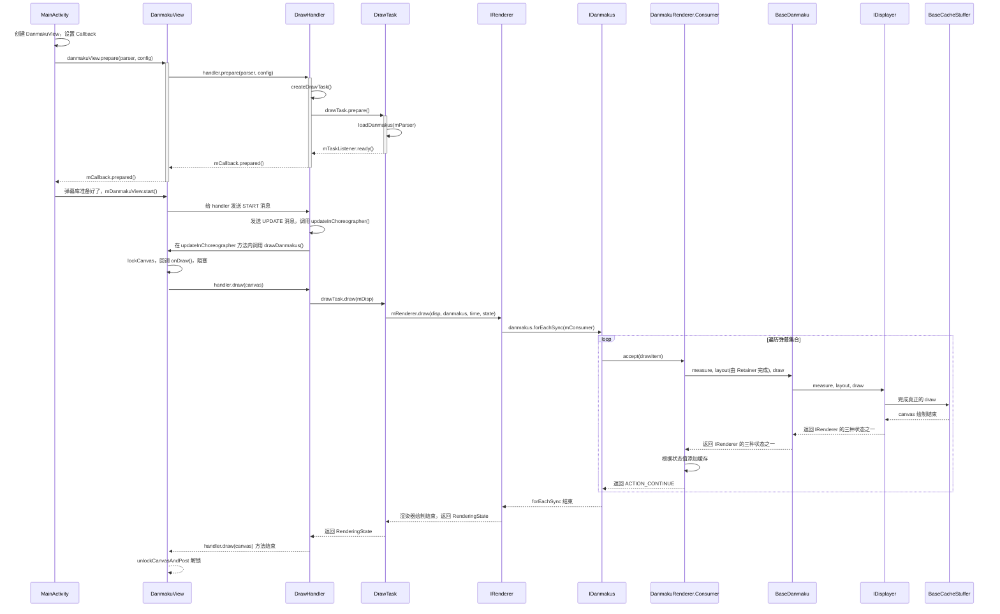

# 烈焰弹幕使源码分析

## 技能掌握

1. View 绘制流程

2. TreeSet、TreeMap、SortedSet 实现原理
3. Renderer、Displayer 概念
4. SurfaceView 掌握

**终极目标：Android 应用程序 UI 架构**

## 1. 简单使用

1. 定义一个 DanmakuView，它继承自 View 并实现了 IDanmakuView，IDanmakuViewController 接口。
2. 创建 DanmakuContext，给 Context 设置相应的属性，比如弹幕的风格、弹幕的大小、弹幕的速度等。
3. 创建一个 BaseDanmakuParser 用来解析弹幕资源。
4. 最后调用 DanmakuView.prepare（Parser，Context） 即可。

## 2. 问题

- 特殊弹幕
- 自定义弹幕样式

## 3. DanmakuView

IDanmuView 如何驱动数据，以弹幕的形式滚动起来？通过 DrawHandler

- 可以在 prepare() 之前通过 setDrawingThreadType() 来调整 draw Thread 优先级
- Displayer 显示器，Render 渲染器

DrawHandler(任务分发器) 应该会通过 UpdateThread 驱动 Displayer 和 DrawTask

1. **prepare：**记录 mTimeBase，创建 DrawTask，如果创建成功则回调 Callback.prepared()

1. 把循环先跑起来。通过每一帧的监听，去 drawDanmakus()
2. problem 绘制一卡一卡的
3. ==明日== problem SEEK_POS 和 RESUME 重复？

------
git rebase 测试:
当前在 feat1，提交 1。
当前在 feat1，提交 2。

